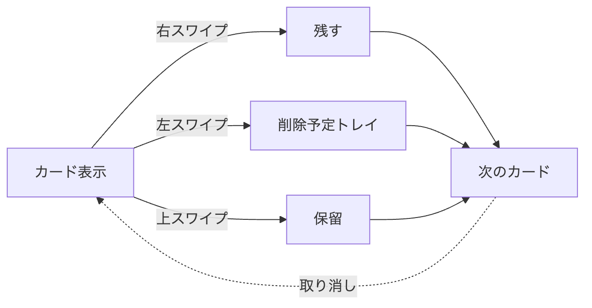
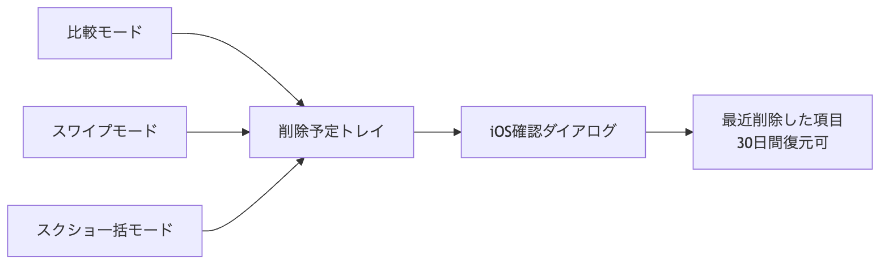
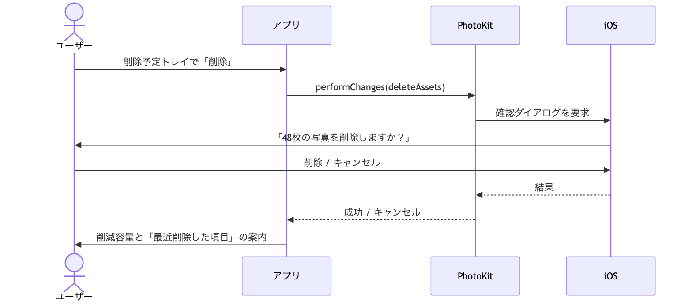
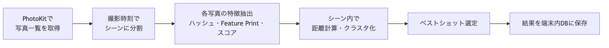

# 類似写真クリーナー iOSアプリ PRD

最終更新: 2026-09-24

## 結論サマリー

**iPhone内のローカルAIだけで作れるので、MVPでは独自モデルの学習は要らない。** AppleのVisionフレームワークには、画像の類似度ベクトルを出す機能（Image Feature Print）と、写真の出来栄えを採点する機能（Aesthetics Score）が標準で入っている。サーバーも学習データも使わずに「似た写真をまとめる → ベストを残す → 残りの削除を提案」までできる。

- **類似判定**: Vision の `VNGenerateImageFeaturePrintRequest` で写真ごとに特徴ベクトルを作り、`computeDistance` で距離を測る。撮影日時や位置が近い写真だけを比べれば、計算量も小さく済む。
- **ベストショット選定**: Vision の美的スコア（iOS 18+）、顔の撮影品質スコア、ブレ・露出の簡易指標を組み合わせて1枚を推す。
- **削除**: PhotoKit で削除を要求すると、iOSが必ず確認ダイアログを出す。削除した写真は「最近削除した項目」に30日残るので、誤削除のリスクはOS側でも抑えられる。
- **独自モデルが要る場面**: 標準モデルの精度が足りないと検証で分かった場合だけ。その場合もまずは学習せず、公開済みの軽量モデル（例: MobileCLIP）をCore MLに変換して組み込む。ゼロからの学習はほぼ要らない。
- **LLM（Apple Foundation Models）は主役ではない**: 類似判定は埋め込みベクトルの仕事。LLMはグループの説明文生成などの補助に限る。

## 背景・ターゲット・ゴール

同じシーンを何枚も撮るうちに、カメラロールが「ほぼ同じ写真」で埋まり、ストレージやiCloudの容量を圧迫する。写真アプリ標準の「重複項目」が拾うのはほぼ完全一致の画像だけで、構図や表情が少し違う連写は対象外。このアプリは、その「似ているが別ファイル」の写真を整理する。

**位置づけ**: 無料・個人利用のアプリとして作る。課金や広告は入れない。最低対応OSは iOS 26。

**ターゲットユーザー**

- 子ども・ペット・旅行などで連写しがちな人（写真数千〜数万枚）
- iPhoneストレージやiCloudの容量不足に悩む人
- 写真をクラウドに送る整理アプリに抵抗がある人

**ゴール**

1. 似た写真を自動でグループ化し、各グループで残すべき1枚を提案する
2. 似た写真を並べて比較しながら、残す写真を選べる
3. スクリーンショットをまとめて整理できる
4. カードを左右にスワイプするだけで、残すか消すかを決められる
5. 選んだ写真を数タップで削除でき、削減容量（GB）を見せる
6. 写真を端末外に一切出さない（完全オンデバイス）

**成功指標（仮置き）**

- 提案の採用率（提案した削除候補のうち実際に削除された割合）≥ 60%
- 初回スキャン後の1ユーザーあたり削減容量 ≥ 1 GB
- 誤グループ化の報告率（「似ていない」ボタンの押下率）≤ 5%

**非ゴール（MVPではやらない）**

- 動画の重複検出
- クラウドバックアップ・写真の圧縮
- ユーザーの確認なしの自動削除

## 機能要件

優先度は P0 = MVP必須、P1 = 初期リリース直後、P2 = 将来。

| ID | 機能 | 内容 | 優先度 |
| --- | --- | --- | --- |
| F1 | 写真ライブラリへのアクセス | フルアクセス権限を要求。限定アクセス時は選択された写真だけを対象にし、理由を説明する | P0 |
| F2 | スキャン | 写真ごとに特徴ベクトルと品質スコアを計算し端末内に保存。進捗表示、中断・再開可能 | P0 |
| F3 | 差分スキャン | 2回目以降は追加・変更された写真だけを処理（PhotoKitの変更履歴を利用） | P0 |
| F4 | 類似グループ化 | 撮影時刻が近く、特徴ベクトルの距離が閾値以下の写真をまとめる。バースト連写は必ず1グループ | P0 |
| F5 | ベストショット推薦 | グループ内で1枚を「残す」、他を「削除候補」にして理由（ブレが少ない、目を開いている等）を表示 | P0 |
| F6 | グループ一覧 | 類似グループを削減容量の大きい順に表示。「このグループは似ていない」で除外 | P0 |
| F7 | 比較しながら削除 | グループ内の写真を2枚並べて表示し、ズーム・スクロールを両方で同期。シャープネス・顔品質・解像度の差を表示し、各写真を残す/削除で切替 | P0 |
| F8 | スワイプ整理 | カードを右スワイプで「残す」、左スワイプで「削除予定」。取り消しボタンで直前の操作を戻す。対象は類似グループ・スクショ・月別の全写真から選ぶ | P0 |
| F9 | スクリーンショット一括整理 | スクショを期間別（例: 30日以上前）に一覧表示し、全選択・個別解除で削除予定へ。レシート・書類などの実用写真も別枠で提示 | P0 |
| F10 | 削除予定トレイと一括削除 | 全モードで選んだ削除予定を1か所に集め、確認のうえまとめて削除。iOSの確認ダイアログを経て「最近削除した項目」へ | P0 |
| F11 | 削減容量の表示 | 候補ごと・合計の容量（GB）を表示し、削除後に実績を表示 | P0 |
| F12 | 保護ルール | お気に入り、共有アルバム、編集済み写真は削除候補にしない。スワイプで左に送った場合も確認を挟む | P0 |
| F13 | 感度設定 | 「あまりにも似ているものだけ / 広めに」の3段階スライダー | P1 |
| F14 | スクショの自動分類 | 画面内の文字を端末内で読み取り、「チャット」「地図」「QRコード」などに分類して整理しやすくする | P1 |
| F15 | 定期スキャン通知 | 「今週の似た写真 42枚・スクショ 15枚」を充電中に処理して通知 | P1 |
| F16 | グループの説明文 | 「海辺の集合写真 8枚」のようなラベルをオンデバイスLLMで生成 | P2 |
| F17 | 動画・Live Photosの重複検出 | キーフレーム単位で比較 | P2 |

### 3つの整理モード

どのモードも「その場で削除」ではなく「削除予定トレイに入れる」動作に統一する。iOSは削除のたびに確認ダイアログを出すため、1枚ずつ削除するとスワイプのテンポが崩れる。

| モード | 向いている場面 | 操作 |
| --- | --- | --- |
| 比較モード（F7） | 連写の中から最高の1枚をじっくり選ぶ | 2枚並べて同期ズーム。勝った方を残し、次の写真と比べる勝ち抜き形式も選べる |
| スワイプモード（F8） | 大量の写真をテンポよく仕分ける | 右 = 残す、左 = 削除予定、上 = 保留。片手操作用に「残す / 削除」ボタンも置く |
| 一括モード（F9） | スクショのようにほぼ全部消してよいもの | グリッドで全選択し、残すものだけタップで外す |

### スワイプUIの仕様

- カードは指に追従して傾き、一定距離を超えると確定。傾きに応じて「KEEP」「DELETE」のラベルと色を表示し、確定時に触覚フィードバック
- カードには撮影日、容量、類似グループ内のベスト推薦かどうかを小さく表示
- 類似グループをスワイプするときは、最後の1枚を左に送ると「全部消えます」と警告する
- セッション終了時に「残す 120枚 / 削除予定 48枚（0.9 GB）」を表示し、そのまま削除予定トレイへ進める
- 実装は SwiftUI の `DragGesture` で位置と回転を制御し、`PHCachingImageManager` で次3枚を先読みして表示遅延をなくす
- VoiceOver利用時はスワイプではなく「残す / 削除」ボタンとカスタムアクションで操作できるようにする

### 削除フロー

ユーザーが必ず候補を見てから削除する流れで、アプリが勝手に消す経路はない。

### 削除のシーケンス

キャンセル時は削除予定をそのままトレイに残し、エラー扱いにしない。

## 技術調査: オンデバイスAIの選択肢

**採用案は「Vision Feature Print（類似判定）＋ Vision 美的スコア・顔品質スコア（ベスト選定）＋ 知覚ハッシュ（完全重複の高速検出）」。** いずれもOS標準か数十行の自前実装で済み、モデルの同梱も学習も要らない。

| 選択肢 | 役割 | 対応OS | モデル同梱 | 強み | 弱み | 評価 |
| --- | --- | --- | --- | --- | --- | --- |
| [Vision Image Feature Print](https://developer.apple.com/documentation/vision/vngenerateimagefeatureprintrequest) | 類似度ベクトルと距離計算 | iOS 13+（Swift版APIはiOS 18+） | 不要 | 構図や表情の少しの違いに強い。実装が数行 | 距離の閾値は自分で調整。OSのリビジョンでベクトルが変わる（iOS 17で変更済み） | **主軸** |
| [Vision 美的スコア](https://developer.apple.com/documentation/vision/calculateimageaestheticsscoresrequest) | ベストショット選定、スクショ等の判別 | iOS 18+ | 不要 | −1〜1の総合スコア（ブレ、露出、構図を考慮）と `isUtility` 判定 | 連写間の微差は拾いにくい可能性 | **主軸** |
| Vision 顔の撮影品質（`VNDetectFaceCaptureQualityRequest`） | 人物写真のベスト選定 | iOS 13+ | 不要 | 目つぶり・ブレ・向きを顔単位で評価 | 顔がない写真には効かない | **主軸** |
| 知覚ハッシュ（dHash / pHash） | ほぼ同一画像の高速検出 | 全て（自前実装） | 不要 | 64bitで超高速・省メモリ | 表情・構図が変わると別物扱い | 補助 |
| [MobileCLIP2](https://github.com/apple/ml-mobileclip) ＋ Core ML / Core AI | より意味的な類似判定、文字検索 | iOS 17+（Core AIはiOS 27+） | 要（画像側 11〜322Mパラメータ） | 1枚1.5〜20ms程度、「犬の写真」のような文字検索も可能 | モデルの利用規約（Apple ML Research Model TOU）が商用可か要確認。アプリ容量増 | 精度不足時の第2案 |
| [Foundation Models](https://developer.apple.com/videos/play/wwdc2026/241/)（オンデバイスLLM） | グループ説明文の生成、「なぜこの1枚か」の説明 | iOS 26+（画像入力はiOS 27+、Apple Intelligence対応機のみ） | 不要 | 画像を添付して自然言語で質問できる | 埋め込みベクトルは出せない。コンテキスト8192トークンで数万枚の比較には不向き | P2の補助のみ |
| 独自モデルの学習（Create ML / PyTorch） | 自社データに最適化した類似判定 | — | 要 | 特定ドメインで最高精度を狙える | 「似ている/いない」のラベル付きペアが数千〜数万組必要。工数大 | 当面不要 |

**スクリーンショット判定はAI不要**: iOSが撮影時に写真へ種別を付けており、`PHAsset.mediaSubtypes` の `.photoScreenshot` で確定的に抽出できる。レシートや書類の写真は美的スコアの `isUtility` で拾い、P1の自動分類は Vision の文字認識（`RecognizeTextRequest`）とバーコード検出で賄える。

**独自モデルが要るかの判断基準**: 自分のカメラロールから「似ているペア / 似ていないペア」を各200組ほど作り、Feature Printの距離で適合率・再現率を測る。誤グループ化（削除候補に入っては困るもの）が多ければMobileCLIP2で再測定し、それでも足りない時だけ追加学習を検討する。

**iOS 27の新要素**: WWDC26で [Core AI](https://developer.apple.com/core-ai/) が発表され、PyTorchモデルを変換して端末で動かす新しい標準ルートになった。ただしiOS 27以降限定のため、外部モデルを組み込む場合も当面はCore MLが現実的。

## 処理パイプラインとアーキテクチャ

**全写真を総当たりで比べず、撮影時刻で区切った「シーン」の中だけで比較する。** 2万枚でも比較回数は数万〜数十万回に収まり、距離計算は一瞬で終わる。時間がかかるのは各写真の特徴抽出の方。

各ステップの詳細:

1. **写真一覧の取得**: `PHAsset.fetchAssets(with: .image)` を撮影日時順で取得。`burstIdentifier` が同じ連写は最初から1グループ。
2. **シーン分割**: 隣り合う写真の撮影間隔が一定秒数（初期値 60秒、要調整）を超えたら区切る。位置情報があれば距離も条件に加える。
3. **特徴抽出**: `PHImageManager` で長辺 512px 程度のサムネイルを取得し、以下を計算。原寸画像は読まない。
    - dHash（64bit）
    - Vision Feature Print（リビジョン番号も保存）
    - 美的スコア、`isUtility`、顔の撮影品質、シャープネス（ラプラシアン分散）
4. **クラスタ化**: シーン内の全ペアで距離を計算し、閾値以下のペアを Union-Find で連結。dHash のハミング距離が極小のペアは「ほぼ同一」として別ラベル。
5. **ベスト選定**: 下式のスコア最大の1枚を「残す」に。お気に入り・編集済みは強制的に「残す」。
6. **保存と差分更新**: 結果を SwiftData（または SQLite）に保存。次回からは `PHPhotoLibrary` の変更履歴（persistent change token、iOS 16+）で追加・削除分だけ処理。

$$
\text{score} = w_1 \cdot \text{aesthetics} + w_2 \cdot \text{faceQuality} + w_3 \cdot \text{sharpness} + w_4 \cdot \text{resolution}
$$

重み w1〜w4 は「自分ならどれを残すか」を手で選んだ検証データで調整する。顔が写っていない写真では w2 を 0 にする。

**アーキテクチャ構成**

| レイヤー | 技術 | 備考 |
| --- | --- | --- |
| UI | SwiftUI | グループ一覧、比較ビュー、スワイプ、削除確認 |
| 写真アクセス | PhotoKit（`PHAsset`, `PHImageManager`, `PHAssetChangeRequest`） | 取得・サムネイル・削除 |
| 解析 | Vision（Feature Print, 美的スコア, 顔品質）、Accelerate（ハッシュ、シャープネス） | すべて端末内 |
| 並列化 | Swift Concurrency（同時実行数を制限した TaskGroup） | 発熱とメモリを見て同時数を調整 |
| 永続化 | SwiftData / SQLite | 写真のローカルID、ベクトル、スコア、グループ |
| バックグラウンド | BackgroundTasks（`BGContinuedProcessingTask` iOS 26+、`BGProcessingTask`） | 下記「iOSプラットフォームの制約」参照 |

## iOSプラットフォームの制約

**最大の制約は「削除は必ずOSの確認を経る、容量は『最近削除した項目』を空にするまで戻らない」こと。** アプリはこれを前提にUXを設計する。最低対応OSは **iOS 26** とし、ユーザーが開始したスキャンを `BGContinuedProcessingTask` でバックグラウンドでも続けられる前提で設計する（美的スコアやSwift版Vision APIも使える）。

| 項目 | 制約 | 対応方針 |
| --- | --- | --- |
| 写真へのアクセス権 | フルアクセスが必要。限定アクセスだと選ばれた写真しか見えない | 許可前に「写真は端末外に出ない」を説明。限定アクセスでも動くようにする |
| 削除の確認 | `PHAssetChangeRequest.deleteAssets` は必ずシステムの確認シートを出す。バックグラウンドからは削除できない | 削除はまとめて1回の確認に集約。キャンセルを正常系として扱う |
| 容量の解放 | 削除した写真は「最近削除した項目」に30日残り、その間容量は空かない。アプリから完全削除するAPIはない | 削除後に「写真アプリで最近削除した項目を空にすると容量が戻る」と案内 |
| iCloud写真 | 「iPhoneのストレージを最適化」では原寸が端末にない。削除は全デバイスに同期される | 解析は端末内のサムネイルで行い、標準ではネットワーク取得をオフ。削除前に「iCloudからも消える」と明示 |
| バックグラウンド処理 | アプリを閉じると処理が止まる | ユーザーが開始したスキャンは `BGContinuedProcessingTask`（iOS 26+、進捗をシステムUIで表示）、定期スキャンは充電中の `BGProcessingTask` で実行 |
| ファイル容量の取得 | 写真1枚のバイト数を返す公開APIがない（`PHAssetResource` の非公開キーを使う実装例が多い） | 審査リスクを要調査。代替は解像度と形式からの推定値表示 |
| 標準機能との重なり | 写真アプリの「重複項目」（iOS 16+）が完全一致の写真を統合できる | 差別化は「似ているが違う写真」とベストショット選定に置く |

**性能の目安（未実測・概算）**: サムネイル読込とVisionの各処理で、1枚あたり数十ms程度と見込む。写真2万枚なら初回スキャンは10〜20分前後。Feature Print の保存は1枚数KB程度で、全体で数十MB。プロトタイプで実機計測して確定させる。

## 非機能要件・プライバシー・競合・リスク

**非機能要件**

- **プライバシー**: 写真・特徴ベクトル・スコアを端末外に送信しない。分析ログを入れる場合も件数・処理時間などの集計値のみ。App Storeのプライバシー表示は「データの収集なし」を目指す。
- **性能**: 2万枚の初回スキャンを 20分以内、差分スキャンを 10秒以内（数十枚の追加時）。スキャン中もUIは60fpsを維持。
- **リソース**: スキャン中のメモリ使用を 300MB 以下に抑え、端末が高温になったら `ProcessInfo.thermalState` を見て減速。
- **安全性**: お気に入り・編集済み・共有済みは削除候補にしない。各グループで最低1枚は必ず残るようにUIで保証。
- **アクセシビリティ**: VoiceOverで「この写真を残す理由」を読み上げ、Dynamic Type に対応。

**競合**

類似写真の整理アプリは既に多く、主要アプリはほぼオンデバイス処理。「端末内で処理」だけでは差別化にならない。

| アプリ | 価格モデル | 特徴 |
| --- | --- | --- |
| 写真アプリ標準の「重複項目」 | 無料（OS標準） | 完全一致のみ。高画質版とメタデータを統合 |
| CleanMy®Phone（MacPaw、旧Gemini Photos） | サブスク | 類似・ブレ・スクショを分類。完成度が高い |
| Clever Cleaner | 無料 | 類似検出あり。UIは実用本位 |
| Favvy | 無料枠＋有料 | スワイプ型。類似・連写に対応 |
| Slidebox | 無料＋有料 | 手動寄り。連写をスワイプで比較 |

この競合表は競合企業自身の比較記事（[Favvy blog](https://www.favvyapp.com/en/blog/top-5-apps-to-clean-photos)）を含むため、実際に各アプリを試して確かめる必要がある。スワイプUIは Favvy や Slidebox も採用しており、それだけでは差別化にならない。差別化候補は「比較・スワイプ・一括の3モードを同じ削除予定トレイでつなぐ体験」「ベストショットを選んだ理由の説明」「誤削除しない安心設計」「課金・広告なしの無料」。

**リスク**

| リスク | 影響 | 対策 |
| --- | --- | --- |
| 大切な写真の誤削除 | 信頼喪失、低評価レビュー | 自動削除しない、最近削除した項目の案内、保護ルール |
| 類似の閾値が人の感覚と合わない | 採用率低下 | 実データで調整、感度スライダー、「似ていない」フィードバック |
| OS更新で Feature Print の版が変わる | 過去のベクトルと距離が比較不能 | リビジョンを固定指定し保存。変わったら再計算 |
| 端末の発熱・電池消費 | 不満・処理中断 | 充電中の処理を優先、同時実行数の制御 |
| 外部モデル（MobileCLIP2）の利用規約 | 商用不可なら使えない | 採用前に規約確認。代替は商用可のオープンモデル |
| 容量取得の非公開API利用 | 審査リジェクト | 公開APIのみで推定値を表示 |

## 実現可能性とロードマップ

**実現可能性は高い。技術面で不確かなのは「類似の閾値」と「ベスト選定の重み」の調整だけで、どちらも実データで検証すれば詰められる。** 難しいのはモデルよりも、誤削除を防ぐUXと競合との差別化。

| 観点 | 評価 | 根拠 |
| --- | --- | --- |
| 類似判定 | 高 | Vision Feature Print が標準搭載。実装例も多い |
| ベスト選定 | 中〜高 | 美的スコア・顔品質は標準。連写間の微差で人の好みと合うかは要検証 |
| 性能 | 高 | シーン分割で比較回数を削減。処理はサムネイルで完結 |
| プライバシー | 高 | サーバー不要、完全オンデバイス |
| 差別化 | 中 | 同様のオンデバイス競合が多数 |

**フェーズ計画（個人開発想定の概算）**

1. **技術検証（1〜2週）**: Feature Print の距離を自分のカメラロールで計測し、閾値と処理速度を実測。およそ200組の正解ペアで適合率・再現率を評価
2. **MVP（6〜8週）**: F1〜F12。スキャン、グループ化、ベスト推薦、比較・スワイプ・スクショ一括の3モード、削除予定トレイ。TestFlightで周りに配布
3. **v1.1**: F13〜F15。感度設定、スクショの自動分類、定期スキャン
4. **v2**: 精度不足なら MobileCLIP2 等を導入。Foundation Models によるグループ説明文、動画対応

**未決事項**

- [x] 最低対応OSを iOS 18 にするか、iOS 26 に上げて `BGContinuedProcessingTask` を前提にするか → 決定: iOS 26
- [x] 収益モデル（買い切り / サブスク / 無料） → 決定: 無料（個人利用）
- [ ] 削除対象に Live Photos・RAW・ポートレートを含めるか
- [ ] 写真1枚の容量を公開APIだけでどこまで正確に出せるか
- [ ] MobileCLIP2 のモデル利用規約が商用アプリでの同梱を許すか

## 出典

- [VNGenerateImageFeaturePrintRequest — Apple Developer Documentation](https://developer.apple.com/documentation/vision/vngenerateimagefeatureprintrequest)
- [CalculateImageAestheticsScoresRequest — Apple Developer Documentation](https://developer.apple.com/documentation/vision/calculateimageaestheticsscoresrequest)
- [Scoring the aesthetics of an image with the Vision framework — Create with Swift](https://www.createwithswift.com/scoring-the-aesthetics-of-an-image-with-the-vision-framework/)
- [What’s new in the Foundation Models framework — WWDC26](https://developer.apple.com/videos/play/wwdc2026/241/)
- [Core AI — Apple Developer](https://developer.apple.com/core-ai/)
- [On-device AI After WWDC 2026 — Callstack](https://www.callstack.com/blog/on-device-ai-after-wwdc-2026-whats-new)
- [apple/ml-mobileclip — GitHub](https://github.com/apple/ml-mobileclip)
- [How to delete the PHAsset from device permanently — Apple Developer Forums](https://developer.apple.com/forums/thread/678736)
- [iOS 16: How to Find, Merge, and Delete Duplicates — MacRumors](https://www.macrumors.com/how-to/remove-duplicates-photo-library-ios/)
- [Best iPhone Photo Clean Up Apps 2026 — Favvy blog](https://www.favvyapp.com/en/blog/top-5-apps-to-clean-photos)
