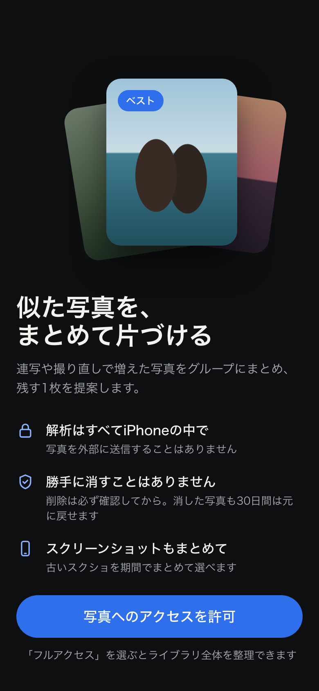
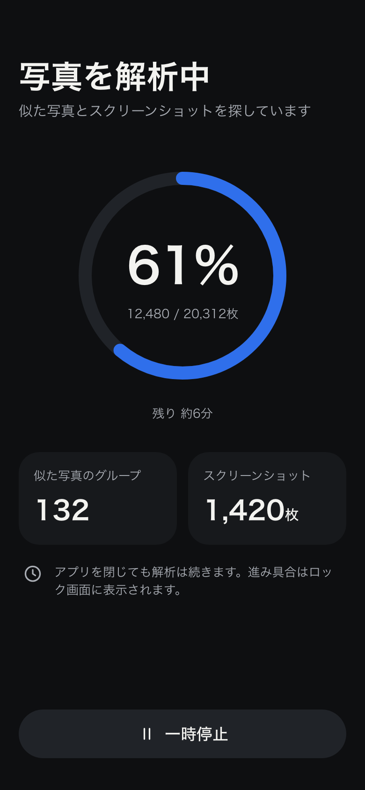
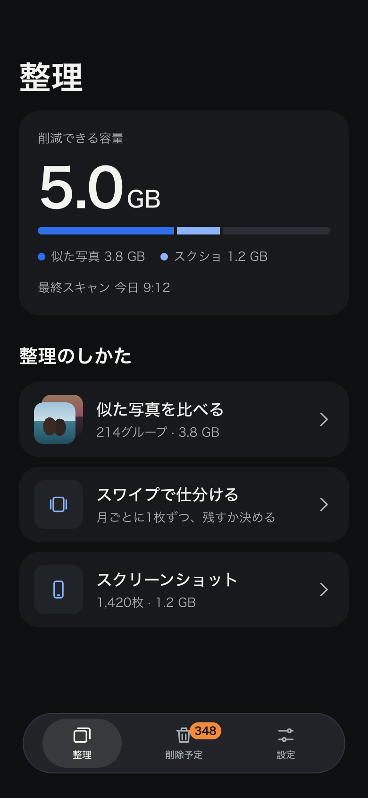
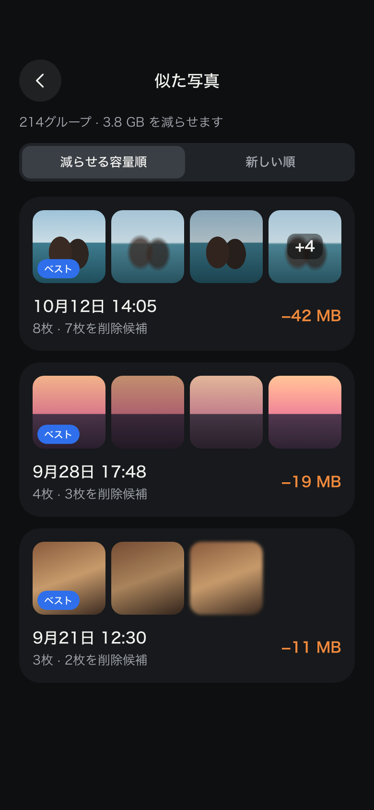
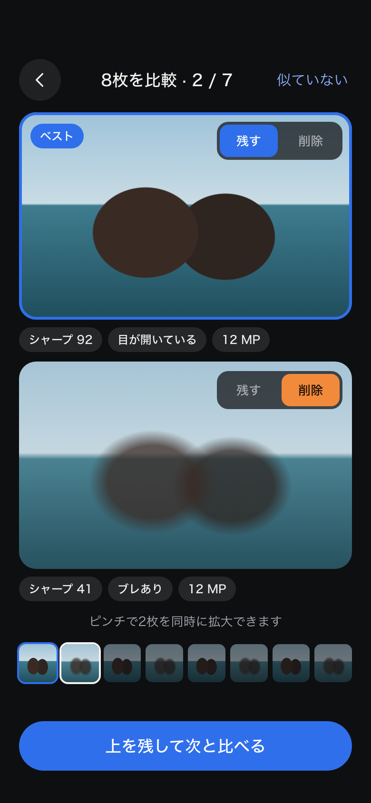
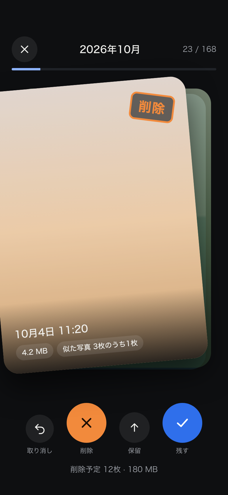
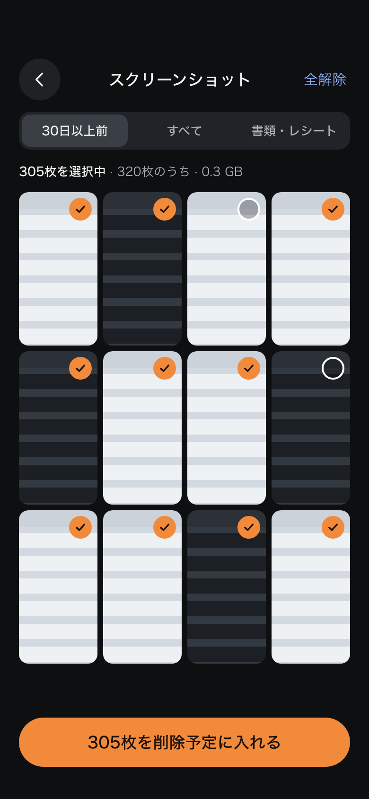
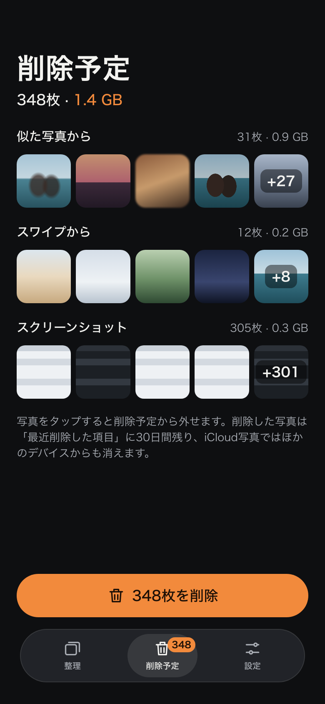

# UIデザイン

最終更新: 2026-09-28 ／ 関連: [PRD](PRD.md)

## 方針: Darkroom

**写真が主役の暗い画面に、「残す＝青」「削除＝オレンジ」の2色だけを使う。** 暗室で現像した写真を選ぶ感覚で、余計な装飾を置かずに写真の差に目が向くようにする。

- 背景はわずかに寒色寄りの黒。写真の色が浮かび、長時間の仕分けでも目が疲れにくい
- 色の役割は2つに限定する。青は「残す・ベスト・主要な操作」、オレンジは「削除・削除予定」。青とオレンジは明るさも違うので、色覚の違いがあっても見分けられる
- 書体は iOS 標準の SF Pro（日本語はヒラギノ角ゴシック）。数字は等幅数字で桁を揃える
- タブバーは iOS 26 の Liquid Glass に合わせた浮いたカプセル型
- 削除はどの画面でも「削除予定トレイに入れる」まで。実際の削除はトレイからまとめて1回

## 画面遷移

## 画面一覧

| # | 画面 | 役割 | 対応機能 |
| --- | --- | --- | --- |
| 1 | オンボーディング | 端末内処理・誤削除しないことを伝えて写真アクセスを許可してもらう | F1 |
| 2 | スキャン中 | 進捗と見つかった件数を表示。アプリを閉じても続行 | F2, F3 |
| 3 | ホーム | 削減できる容量と3つの整理モードへの入口 | F6, F11 |
| 4 | 似た写真一覧 | グループを減らせる容量順に並べる | F4, F6 |
| 5 | 比較モード | 2枚を上下に並べて同期ズームで比べる | F5, F7 |
| 6 | スワイプで仕分け | カードを左右にスワイプして仕分ける | F8 |
| 7 | スクショ一括整理 | 期間で絞り込み、まとめて選ぶ | F9 |
| 8 | 削除予定トレイ | 全モードで選んだ写真を集め、まとめて削除 | F10, F11 |
| 9 | 削除完了 | 削除した量と「最近削除した項目」の空け方を案内 | F11 |

### 1. オンボーディング

- 「端末の中だけで解析」「勝手に消さない」「スクショもまとめて」の3点だけを伝える
- 許可ボタンを押すと iOS の写真アクセスダイアログを表示。限定アクセスを選ばれた場合は、その範囲で動かす

### 2. スキャン中

- 進捗リングと枚数、残り時間の目安を出す
- 解析と並行して、見つかったグループ数とスクショ枚数を増やしていく
- `BGContinuedProcessingTask` により、アプリを閉じても解析が続き、進捗はシステムUI（ロック画面など）に表示される

### 3. ホーム

- 一番上に「削減できる容量」を大きく表示し、内訳を横棒で示す
- 3つの整理モード（似た写真・スワイプ・スクショ）を並べる
- タブは「整理」「削除予定」「設定」の3つ。削除予定の件数はバッジで表示

### 4. 似た写真一覧

- 1グループ = 1カード。先頭の写真に「ベスト」を付け、減らせる容量をオレンジで表示
- 並び順は「減らせる容量順」と「新しい順」

### 5. 比較モード

- 2枚を上下に並べる（縦長の iPhone で1枚あたりの面積を最大化するため）
- ピンチズームとスクロールは2枚で同期する
- 各写真の右上に「残す／削除」の切り替え。下にシャープネス・目の開き・解像度のチップ
- 下のフィルムストリップでグループ内の位置を示す。「上を残して次と比べる」で勝ち抜き形式に進む
- 右上の「似ていない」でグループ自体を除外する

### 6. スワイプで仕分け

- 右スワイプ＝残す、左スワイプ＝削除予定、上スワイプ＝保留
- カードは指に合わせて傾き、傾きに応じて「削除」「残す」のスタンプとオレンジ／青の色が出る
- 下に同じ操作のボタン（取り消し・削除・保留・残す）を置き、片手操作と VoiceOver に対応する
- 上部に月と進み具合（23 / 168）を表示する

### 7. スクショ一括整理

- 「30日以上前」「すべて」「書類・レシート」で絞り込む
- 初めから全選択にしておき、残したいものだけタップで外す
- 選択中の枚数と容量を常に表示する

### 8. 削除予定トレイ

- どのモードから入った写真かで分けて表示する
- 写真をタップするとトレイから外せる
- 「最近削除した項目」に30日残ることと、iCloud写真ではほかの端末からも消えることをボタンの上に明記する
- 「348枚を削除」を押すと iOS の確認ダイアログが出る。キャンセルしたらトレイはそのまま

### 9. 削除完了

- 削除した枚数と容量を大きく表示する
- 容量をすぐに空けるための3ステップ（写真アプリ → 最近削除した項目 → すべて削除）を案内する

## デザイントークン

| トークン | 値 | 用途 |
| --- | --- | --- |
| `bg` | `#0E0F11` | 画面の背景 |
| `surface` | `#17191C` | カード |
| `surface-2` | `#202328` | ボタン（控えめ）・セグメント |
| `text` | `#F3F3F0` | 本文 |
| `text-2` | `#A9ADB4` | 補足・キャプション |
| `keep` | `#2F6FEB` | 残す・ベスト・主要ボタン（白文字） |
| `keep-text` | `#8DB3FF` | 暗い背景上の青い文字・アイコン |
| `delete` | `#F28A3C` | 削除・削除予定（黒文字 `#1B0F06`） |

| 要素 | サイズ |
| --- | --- |
| 大見出し | 34pt Bold |
| 見出し | 17pt Semibold |
| 本文 | 15pt |
| キャプション | 13pt |
| ボタンの高さ | 52pt（角丸は高さの半分） |
| タップ領域 | 最小 44pt |
| カードの角丸 | 22pt、写真の角丸 12〜18pt |
| 画面の左右余白 | 20pt |

SwiftUI では、色を Asset Catalog の Color Set として、サイズを `Font` や定数として定義する想定。

## アクセシビリティ

- 文字と背景のコントラストは 4.5:1 以上。キャプション色 `#A9ADB4` も背景に対して基準を満たす
- 残す／削除は色だけでなく、文字（「残す」「削除」）とアイコン（チェック／バツ）でも区別する
- スワイプ操作には必ず同じ働きのボタンを用意し、VoiceOver ではカスタムアクションで操作できるようにする
- Dynamic Type で文字が大きくなったら、カードの横並びを縦並びに切り替える

## モックアップの編集と再生成

- 画面のソースは `docs/design/mockups/screens/*.html`、共通スタイルは `docs/design/mockups/common.css`
- ブラウザで直接開いて確認できる
- PNG を作り直す: `python3 scripts/build_mockups.py`（Google Chrome が必要）
- デザインキャンバス用のファイルも書き出す: `python3 scripts/build_mockups.py --canvas <出力先>`

写真部分は実写真の代わりに色面を置いたプレースホルダー。
