# UIデザイン

最終更新: 2026-09-28 ／ 関連: [PRD](PRD.md)

## 方針: Darkroom

**写真が主役の落ち着いた画面に、「残す＝青」「削除＝オレンジ」の2色だけを使う。** 暗室で現像した写真を選ぶ感覚で、余計な装飾を置かずに写真の差に目が向くようにする。

- ライトモードとダークモードの両方に対応する。設定の「外観」で自動／ライト／ダークを選べ、既定は端末の設定に従う「自動」
- ダークの背景は真っ黒ではなく、Atom One Dark 寄りの濃いグレー（`#282C34`）。カードはそれより一段明るいグレーで重ねる
- 色の役割は2つに限定する。青は「残す・ベスト・主要な操作」、オレンジは「削除・削除予定」。青とオレンジは明るさも違うので、色覚の違いがあっても見分けられる
- 書体は iOS 標準の SF Pro（日本語はヒラギノ角ゴシック）。数字は等幅数字で桁を揃える
- タブバーと丸いナビゲーションボタンは iOS 26 の Liquid Glass に合わせたガラス表現。下にある内容がぼけて透ける
- 削除はどの画面でも「削除予定トレイに入れる」まで。実際の削除はトレイからまとめて1回

### 角丸は外側と揃える

入れ子になった要素の角丸は **「内側の角丸 = 外側の角丸 − 内側までの余白」** で決める。外側と内側の曲線が同じ中心を持ち、縁の幅が角でも一定に見える。

| 外側 | 余白 | 内側 |
| --- | --- | --- |
| タブバー（高さ64・角丸32） | 6 | 選択中のタブ（高さ52・角丸26） |
| カード（角丸22） | 14 | サムネイル（角丸8） |
| サムネイル（角丸8） | 5 | 「ベスト」ラベル（角丸3） |
| 比較の写真（角丸18） | 10 | 残す／削除の切り替え（角丸8） |
| 比較の写真（角丸18） | 12 | 「ベスト」ラベル（角丸6） |
| 切り替えの枠（角丸8） | 3 | 切り替えボタン（角丸5） |
| セグメント（角丸12） | 3 | セグメントのボタン（角丸9） |
| スイッチ（高さ31・角丸15.5） | 2 | つまみ（直径27・角丸13.5） |

タブバーは選択中のタブが外枠から上下左右とも同じ6ptだけ内側に来るよう、4つのタブで幅を等分する。

## 画面遷移

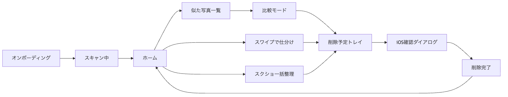

タブは「整理」「削除予定」「実績」「設定」の4つ。

## 画面一覧

| # | 画面 | 役割 | 対応機能 |
| --- | --- | --- | --- |
| 1 | オンボーディング | 端末内処理・誤削除しないことを伝えて写真アクセスを許可してもらう | F1 |
| 2 | スキャン中 | 進捗と見つかった件数を表示。アプリを閉じても続行 | F2, F3 |
| 3 | ホーム | 削減できる容量と3つの整理モード、実績への入口 | F6, F11 |
| 4 | 似た写真一覧 | グループを減らせる容量順に並べる | F4, F6 |
| 5 | 比較モード | 2枚を上下に並べて同期ズームで比べる | F5, F7 |
| 6 | スワイプで仕分け | カードを左右にスワイプして仕分ける | F8 |
| 7 | スクショ一括整理 | 期間で絞り込み、まとめて選ぶ | F9 |
| 8 | 削除予定トレイ | 全モードで選んだ写真を集め、まとめて削除 | F10, F11 |
| 9 | 削除完了 | 削除した量と「最近削除した項目」の空け方を案内 | F11 |
| 10 | 実績 | これまでに削除した容量を月別・整理の種別に見せる | F11 |
| 11 | 設定 | 外観、判定の感度、除外ルール、スキャン、データ | F12, F13, F15 |

各画面は左がダーク、右がライト。

### 1. オンボーディング

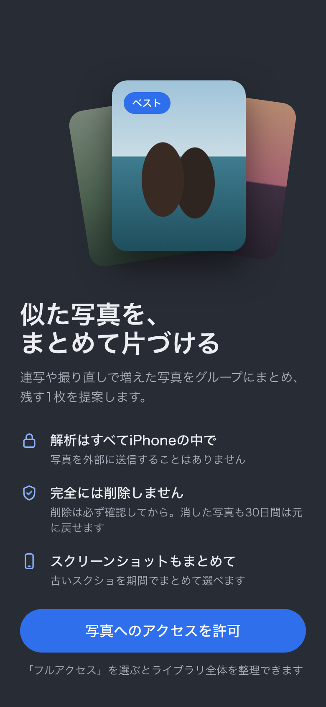 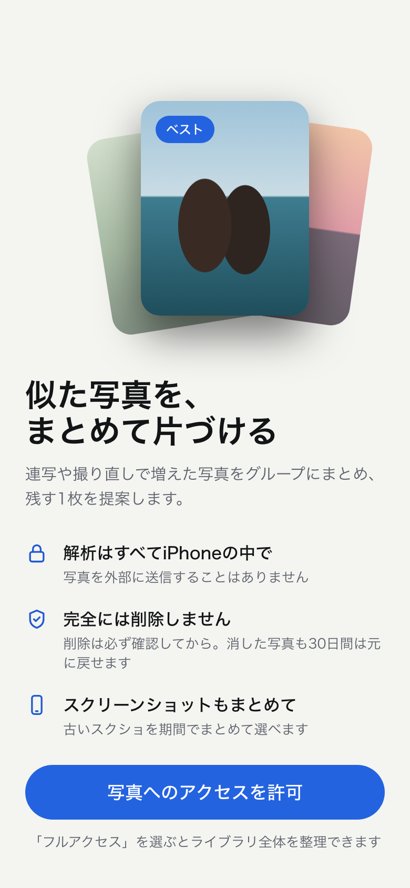

- 「端末の中だけで解析」「完全には削除しない」「スクショもまとめて」の3点だけを伝える
- 許可ボタンを押すと iOS の写真アクセスダイアログを表示。限定アクセスを選ばれた場合は、その範囲で動かす

### 2. スキャン中

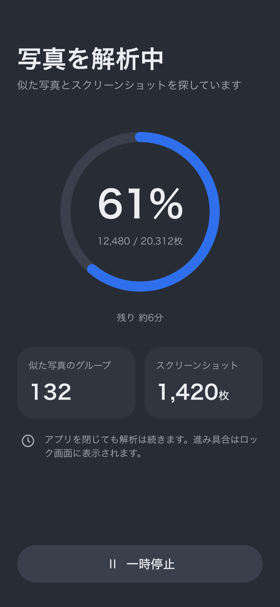 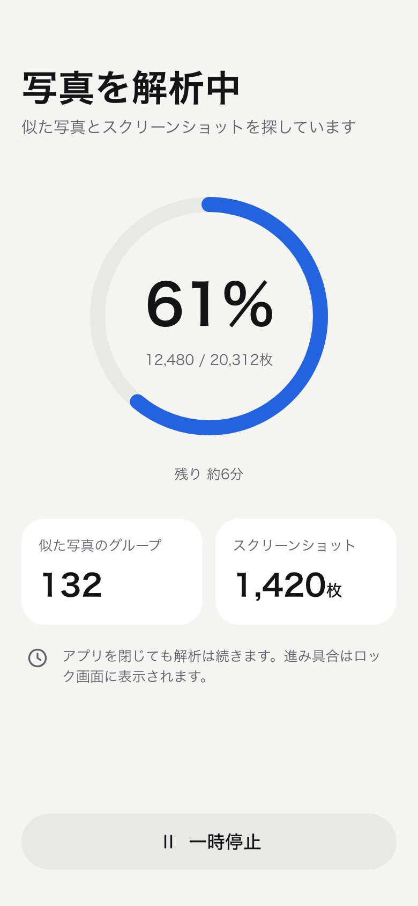

- 進捗リングと枚数、残り時間の目安を出す
- 解析と並行して、見つかったグループ数とスクショ枚数を増やしていく
- `BGContinuedProcessingTask` により、アプリを閉じても解析が続き、進捗はシステムUI（ロック画面など）に表示される

### 3. ホーム

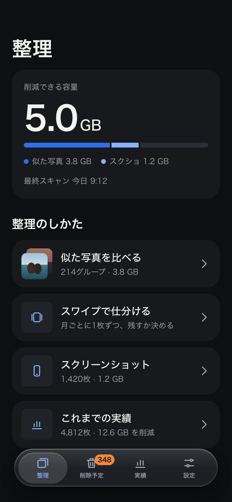 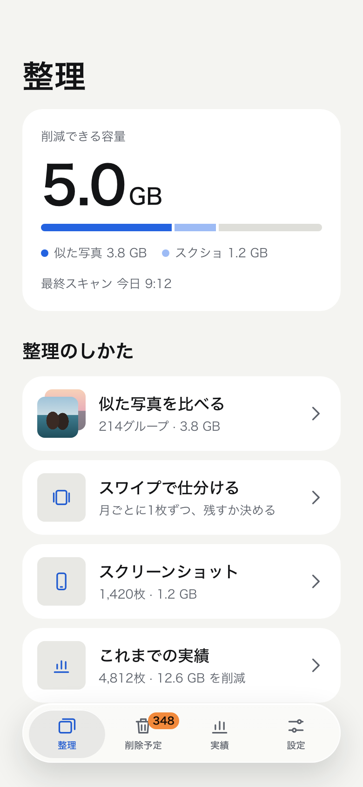

- 一番上に「削減できる容量」を大きく表示し、内訳を横棒で示す
- 3つの整理モード（似た写真・スワイプ・スクショ）と「これまでの実績」を並べる
- 一覧はタブバーの下まで続き、ガラス越しに透けて見える

### 4. 似た写真一覧

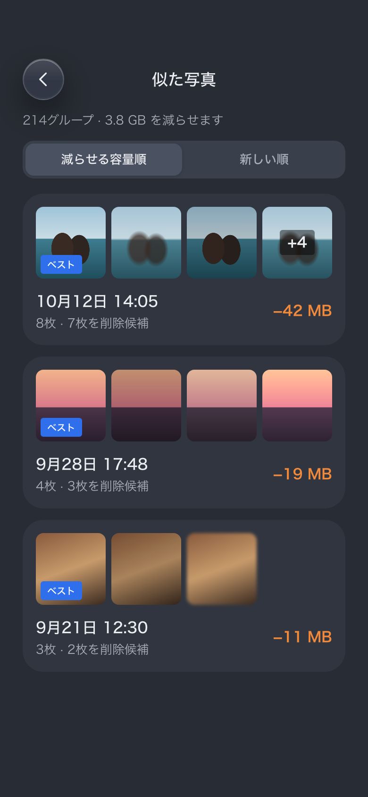 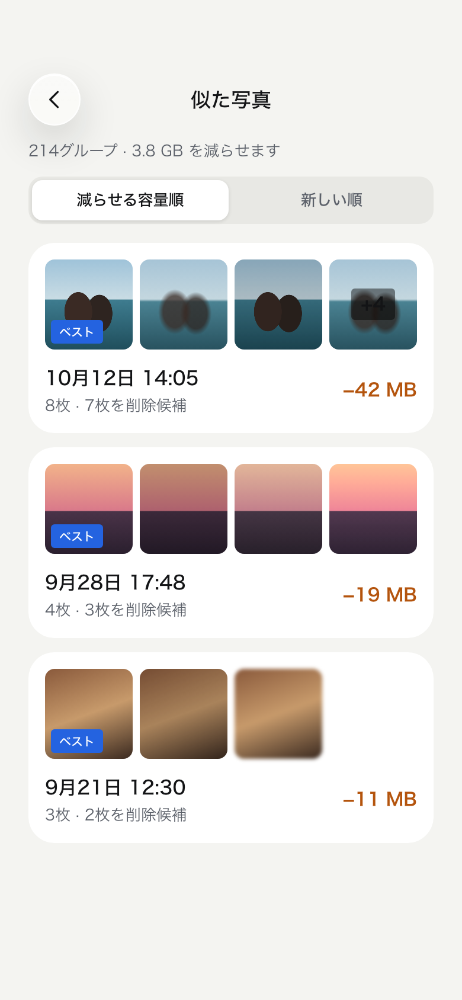

- 1グループ = 1カード。先頭の写真に「ベスト」を付け、減らせる容量をオレンジで表示
- 並び順は「減らせる容量順」と「新しい順」

### 5. 比較モード

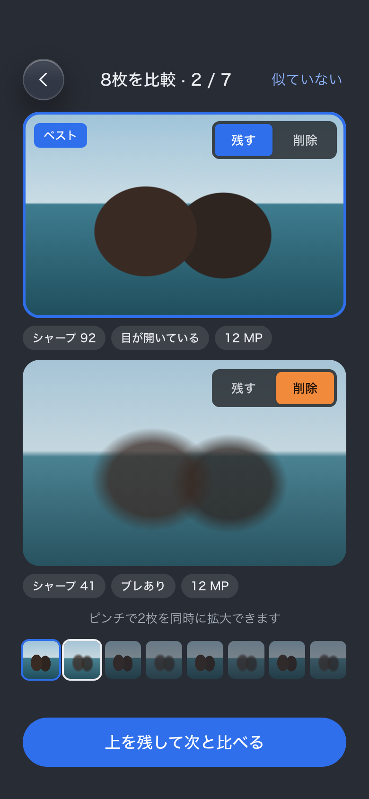 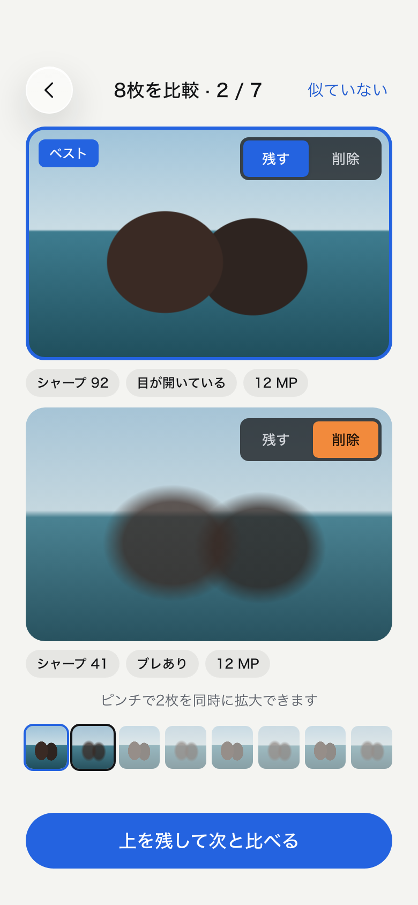

- 2枚を上下に並べる（縦長の iPhone で1枚あたりの面積を最大化するため）
- ピンチズームとスクロールは2枚で同期する
- 各写真の右上に「残す／削除」の切り替え。写真の上に重ねる要素は、テーマによらず暗い下地にする
- 下のフィルムストリップでグループ内の位置を示す。「上を残して次と比べる」で勝ち抜き形式に進む
- 右上の「似ていない」でグループ自体を除外する

### 6. スワイプで仕分け

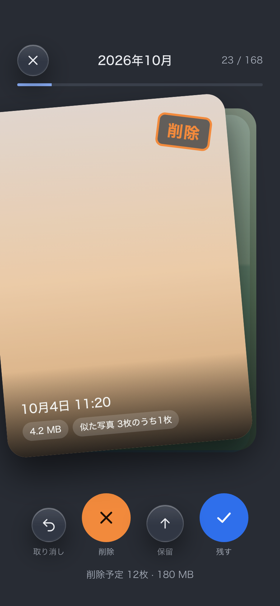 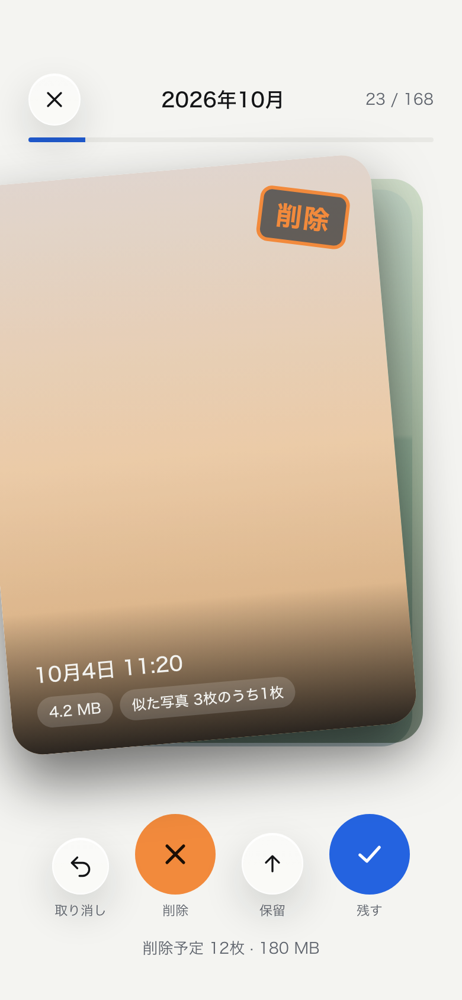

- 右スワイプ＝残す、左スワイプ＝削除予定、上スワイプ＝保留
- カードは指に合わせて傾き、傾きに応じて「削除」「残す」のスタンプとオレンジ／青の色が出る
- 下に同じ操作のボタン（取り消し・削除・保留・残す）を置き、片手操作と VoiceOver に対応する
- 上部に月と進み具合（23 / 168）を表示する

### 7. スクショ一括整理

 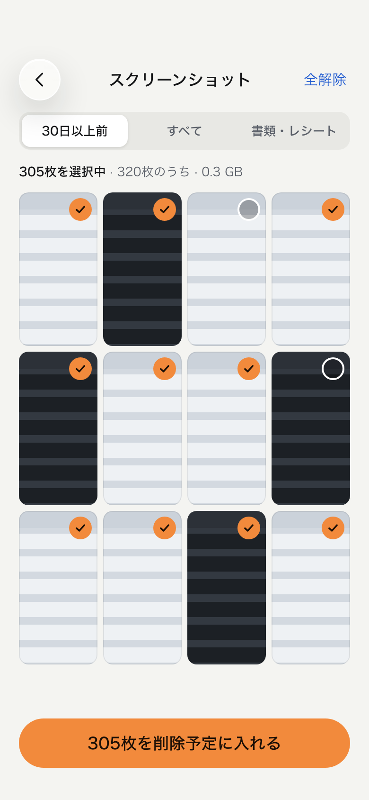

- 「30日以上前」「すべて」「書類・レシート」で絞り込む
- 初めから全選択にしておき、残したいものだけタップで外す
- 選択中の枚数と容量を常に表示する

### 8. 削除予定トレイ

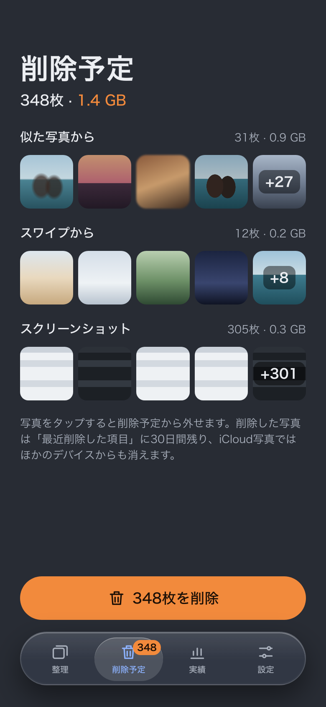 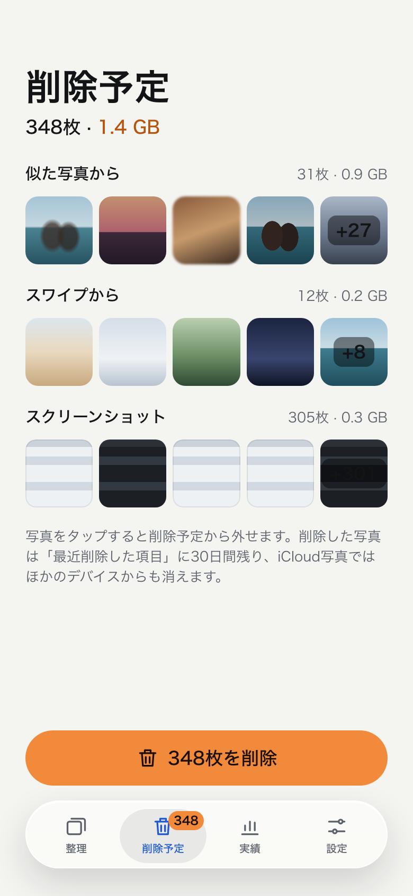

- どのモードから入った写真かで分けて表示する
- 写真をタップするとトレイから外せる
- 「最近削除した項目」に30日残ることと、iCloud写真ではほかの端末からも消えることをボタンの上に明記する
- 「348枚を削除」を押すと iOS の確認ダイアログが出る。キャンセルしたらトレイはそのまま

### 9. 削除完了

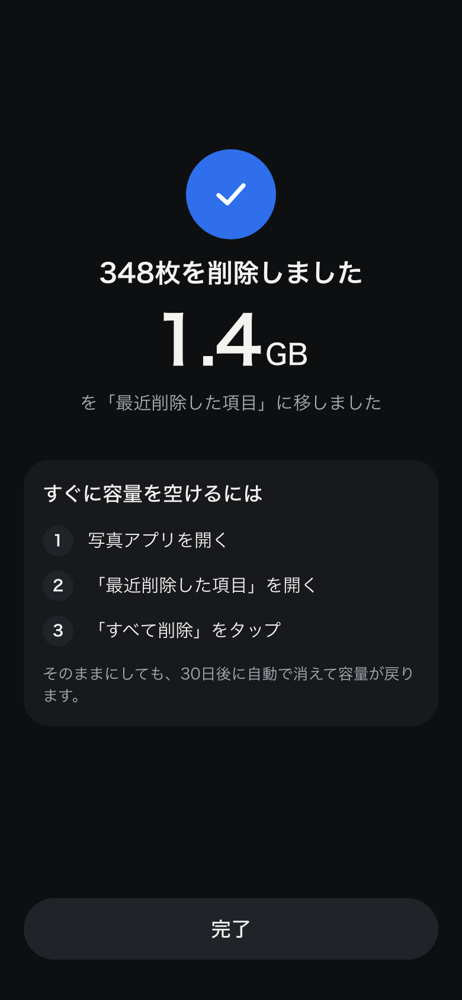 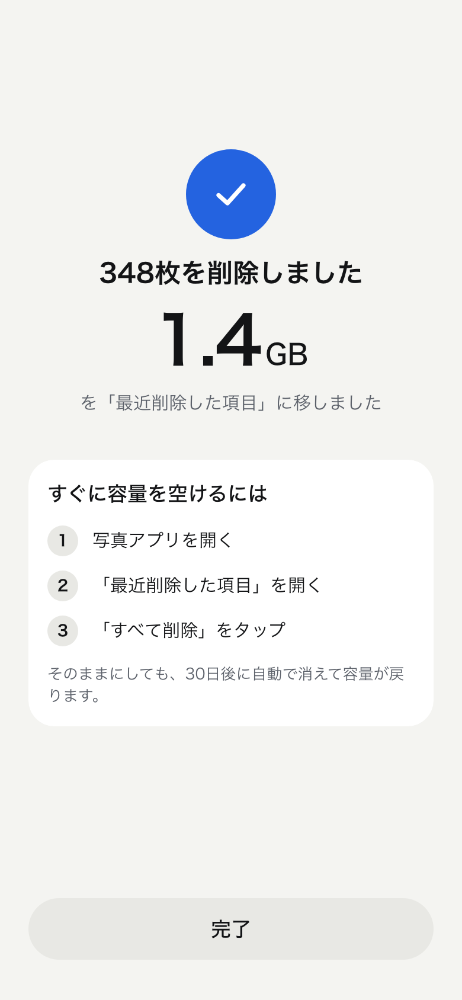

- 削除した枚数と容量を大きく表示する
- 容量をすぐに空けるための3ステップ（写真アプリ → 最近削除した項目 → すべて削除）を案内する

### 10. 実績

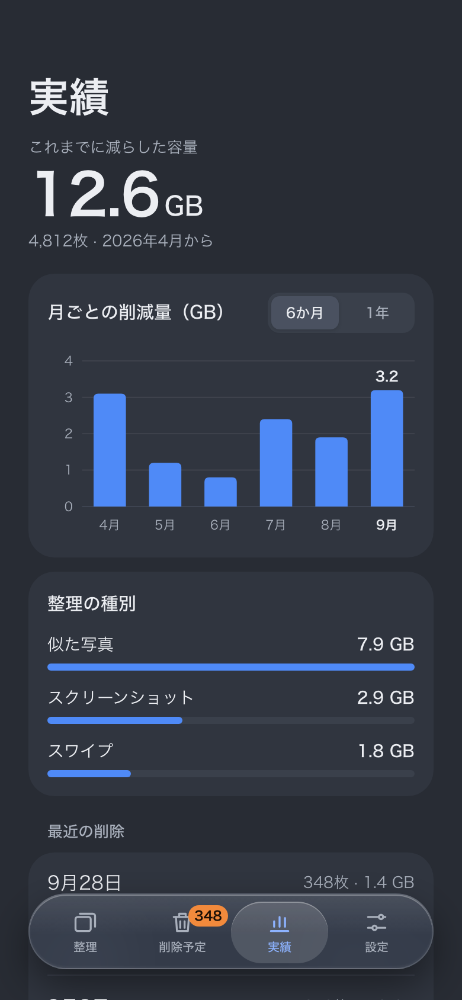 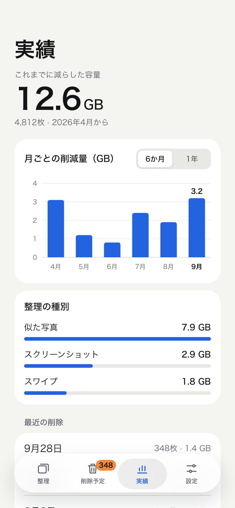

- 一番上に累計の削減容量と枚数（例: 12.6 GB・4,812枚）
- 月ごとの削減量を棒グラフで表示する。期間は「6か月」と「1年」
  - 系列は1つなので凡例は置かず、見出しに単位（GB）を書く
  - 棒は青1色。当月は色を変えず、数値ラベルと太字の月名で示す
  - 棒をタップすると、その月の容量と枚数を表示する（実装は Swift Charts の選択機能を想定）
- 「整理の種別」は、似た写真・スクショ・スワイプの容量を細い横棒で比べる（同じ青1色）
- 「最近の削除」に日付・枚数・容量の履歴を新しい順に並べる
- 実績は端末内に保存した削除の記録から集計する。写真そのものは保存しない

### 11. 設定

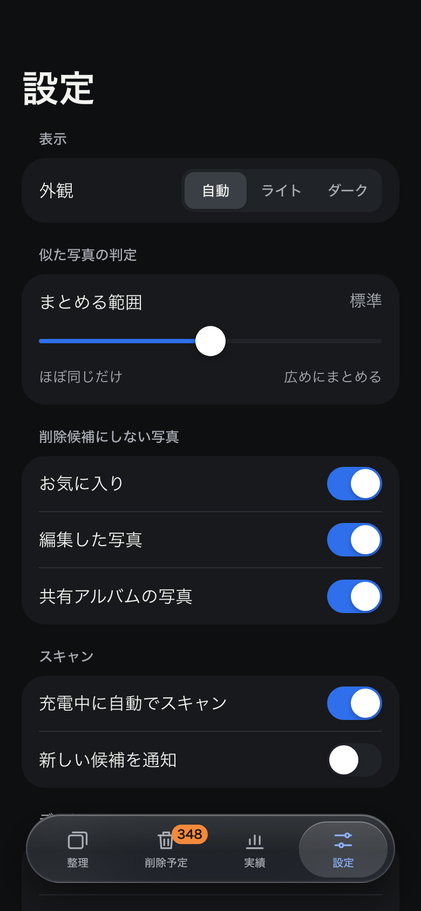 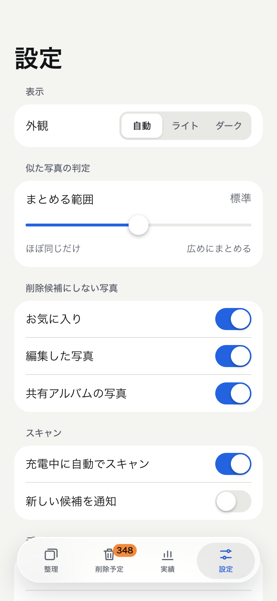

| セクション | 項目 | 既定 |
| --- | --- | --- |
| 表示 | 外観（自動 / ライト / ダーク） | 自動 |
| 似た写真の判定 | まとめる範囲（ほぼ同じだけ ↔ 広めにまとめる の3段階） | 標準 |
| 削除候補にしない写真 | お気に入り / 編集した写真 / 共有アルバムの写真 | すべてオン |
| スキャン | 充電中に自動でスキャン | オン |
| スキャン | 新しい候補を通知 | オフ |
| データ | 解析データの容量表示、最初からスキャンし直す | — |

一番下に「写真と解析データはこのiPhoneの外に送信されません」とバージョンを表示する。

## デザイントークン

| トークン | ダーク | ライト | 用途 |
| --- | --- | --- | --- |
| `bg` | `#282C34` | `#F4F4F1` | 画面の背景 |
| `surface` | `#30353F` | `#FFFFFF` | カード・リスト |
| `surface-2` | `#3A404B` | `#E8E8E4` | 控えめなボタン・セグメント・棒の下地 |
| `line` | `#3E4451` | `#DEDED9` | 区切り線 |
| `text` | `#ECEEF2` | `#131416` | 本文 |
| `text-2` | `#A9B0BC` | `#5C616A` | 補足・キャプション |
| `keep` | `#2F6FEB` | `#2463E0` | 残す・ベスト・主要ボタン（白文字） |
| `chart` | `#4F8AF7` | `#2463E0` | グラフの棒（ダークはカードの上で 3:1 を確保するため明るめ） |
| `keep-text` | `#8DB3FF` | `#1F5AD0` | 背景上の青い文字・アイコン・選択中のタブ |
| `delete` | `#F28A3C` | `#F28A3C` | 削除・削除予定の塗り（黒文字 `#1B0F06`） |
| `delete-text` | `#F28A3C` | `#B4540D` | 背景上のオレンジの文字（−42 MB など） |
| `glass-fill` | `rgba(58,63,74,.55)` | `rgba(255,255,255,.52)` | ガラスの面（背景ぼかし 22pt・彩度 180%） |

| 要素 | サイズ |
| --- | --- |
| 大見出し | 34pt Bold |
| 見出し | 17pt Semibold |
| 本文 | 15pt |
| キャプション | 13pt |
| ボタンの高さ | 52pt（角丸は高さの半分） |
| タップ領域 | 最小 44pt |
| カードの角丸 | 22pt（内側は上の「角丸は外側と揃える」に従う） |
| 画面の左右余白 | 24pt（フローティングのタブバーの左右 24pt と揃える） |

SwiftUI では、色を Asset Catalog の Color Set（Any / Dark の2値）として定義し、ガラスは iOS 26 の `glassEffect` を使う想定。

## アクセシビリティ

- 文字と背景のコントラストは両テーマで 4.5:1 以上（例: キャプションはダークの背景で約6.4:1・カード上で約5.6:1、ライトで約5.8:1）
- 青いボタンの白文字は約4.6:1（ダーク）／約5.3:1（ライト）、オレンジの塗りの黒文字は約7.5:1、ダークのカード上のオレンジ文字は約5.0:1
- グラフの青は、両テーマのカードに対して 3:1 以上（dataviz の検証スクリプトで確認済み。ダークでボタンと同じ `#2F6FEB` を使うと 2.7:1 で不足するため `#4F8AF7` を使う）
- 残す／削除は色だけでなく、文字（「残す」「削除」）とアイコン（チェック／バツ）でも区別する
- スワイプ操作には必ず同じ働きのボタンを用意し、VoiceOver ではカスタムアクションで操作できるようにする
- グラフには月ごとの値を読み上げるラベルを付ける
- Dynamic Type で文字が大きくなったら、カードの横並びを縦並びに切り替える

## モックアップの編集と再生成

- 画面のソースは `docs/design/mockups/screens/*.html`、共通スタイルは `docs/design/mockups/common.css`
- ブラウザで直接開くとダークで表示される。ライトは `<main class="screen">` に `theme-light` クラスを足す
- PNG を作り直す: `python3 scripts/build_mockups.py`（`docs/figure/ui/dark` と `docs/figure/ui/light` に出力。Google Chrome が必要）
- デザインキャンバス用のファイルも書き出す: `python3 scripts/build_mockups.py --canvas <出力先>`

写真部分は実写真の代わりに色面を置いたプレースホルダー。
